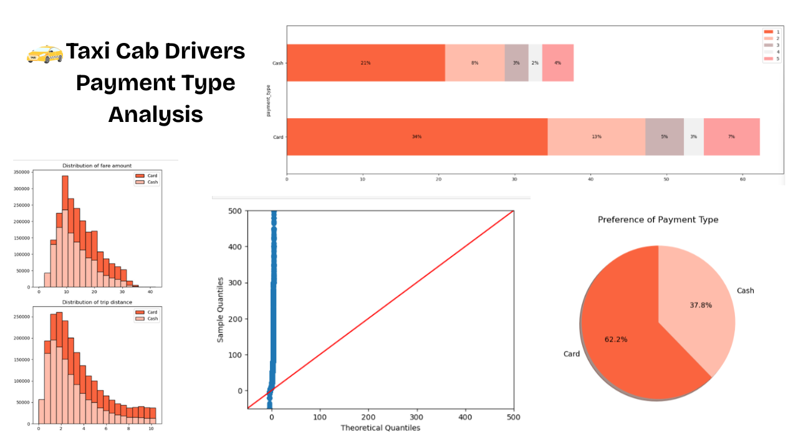

# Taxi-Cab-Drivers-Payment-Type-Analysis
A data-driven exploration of how payment methods impact taxi driver earnings,uncovering the statistical link between cash, card, and fare amounts. Consists of Statistical Exploration and Hypothesis Testing.

  

1. Purpose
In the fast-paced taxi booking sector, maximizing revenue is crucial for both long-term success and driver satisfaction.
This project applies statistical testing and exploratory data analysis to understand how payment methods (Cash vs. Card) influence fare amounts — offering actionable insights for taxi drivers and service providers.
________________________________________
2. Tech Stack
•	 Python – for exploratory and statistical data analysis.
•	 Pandas – for data cleaning, transformation, and preprocessing.
•	 Matplotlib & Seaborn – for data visualization and pattern exploration.
•	 Scipy – for statistical testing (t-test).
•	 Statsmodels.api – for hypothesis validation and inferential statistics.
•	Jupyter Notebook – for interactive documentation and visualization.
________________________________________
3. Data Source
•	Dataset: Yellow Trip Dataset (January 2016)
•	Source: Kaggle
•	Description: Contains NYC taxi trip-level details — including fare amount, payment type, trip distance, and timestamps — providing a real-world foundation for revenue pattern analysis.
________________________________________
4. Problem Statement
In the fast-paced taxi booking sector, making the most of revenue is essential for long-term success and driver happiness.
Our goal is to use data-driven insights to maximize revenue streams for taxi drivers.
This research aims to determine whether payment methods impact fare pricing, focusing on the relationship between payment type and fare amount.
________________________________________
5. Objective
The project’s main objective is to run an A/B test to examine the relationship between total fare and method of payment.
By using Python-based hypothesis testing and descriptive statistics, the analysis identifies meaningful trends that can help taxi drivers generate higher revenue.
________________________________________
6. Research Question
Is there a relationship between total fare amount and payment type, and can we nudge customers toward payment methods that generate higher revenue for drivers — without negatively impacting customer experience?
________________________________________
7. Analytical Approach
1.	Data Cleaning & Preparation – Removed nulls, duplicates, and outliers.
2.	Explanatory Data Analysis – Visualized fare distributions and payment patterns.
3.	Hypothesis Testing –
o	Null Hypothesis (H₀): No difference in average fare between card and cash payments.
o	Alternative Hypothesis (H₁): A difference exists between the two.
4.	Statistical Results:
o	T-statistic: 39.95
o	P-value: 0.00
o	Since the P-value < 0.05, the Null Hypothesis is rejected — indicating a significant difference between payment methods.
________________________________________
8. Key Findings & Insights
•	Card payments correspond to higher average fares, especially on long-distance trips.
•	Statistical evidence (T = 39.95, P = 0.00) strongly supports the impact of payment method on fare value.
•	Data visualization confirms clear behavioral trends between cash vs. card users.
________________________________________
9. Recommendations
•	Encourage customers to pay with credit cards to help drivers capitalize on higher fare patterns.
•	Introduce incentives or loyalty rewards for digital payments to increase adoption.
•	Use real-time analytics dashboards to monitor fare trends by payment mode for future decision-making.
________________________________________
10. Conclusion
The study concludes that payment type significantly influences total fare.
Through the combination of EDA and hypothesis testing, this project demonstrates how statistical methods can uncover actionable insights that support smarter business and operational strategies in the taxi industry.
